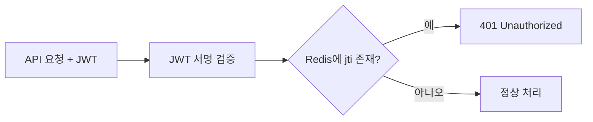

# Redis 개념

## Redis란?

Redis(Remote Dictionary Server)는 **인메모리 키-값 데이터 저장소**입니다. 기존 RDBMS(관계형 DB)와 달리 데이터를 디스크가 아닌 **메모리(RAM)**에 저장하여 초고속 읽기/쓰기가 가능합니다.

| 특성 | Redis | RDBMS (MariaDB) |
|------|-------|-----------------|
| 저장 위치 | 메모리 (RAM) | 디스크 (SSD/HDD) |
| 읽기 속도 | ~0.1ms | ~10ms |
| 데이터 구조 | Key-Value, String, Hash, List, Set, Sorted Set | 테이블, 행, 열 |
| 영속성 | 선택적 (RDB 스냅샷 / AOF 로그) | 필수 (ACID) |
| 주요 용도 | 캐싱, 세션, 메시지 브로커 | 영구 데이터 저장 |

## Redis가 DB와 다른 점

Redis를 "DB"라고 오해하기 쉬우나, 실제로는 **캐시/세션 저장소**에 가깝습니다.

- Redis는 **데이터 영구 보관이 주 목적이 아님** — 서버 재시작 시 데이터 유실 가능 (설정에 따라 복구 가능)
- Redis는 **복잡한 쿼리, 조인, 트랜잭션을 지원하지 않음** — 단순 키-값 조회에 특화
- Redis는 **모든 데이터를 메모리에 저장**하므로, 저장할 수 있는 데이터 양이 RAM 용량으로 제한됨

즉, "영구 저장이 필요하고 복잡한 검색이 필요한 데이터 → MariaDB", "빠른 임시 저장이 필요하고 단순 조회만 하는 데이터 → Redis" 로 구분합니다.

## 주요 자료구조

| 자료구조 | 설명 | 활용 예 |
|---------|------|---------|
| String | 단일 키-값 | JWT blocklist, rate limit 카운터 |
| Hash | 필드-값 맵 | 세션 정보 (userAgent, IP, loginTime) |
| Set | 중복 없는 문자열 집합 | 활성 세션 ID 목록 |
| Sorted Set | 점수 기반 정렬 Set | 최근 접속 순서 세션 정렬 |
| List | 양방향 연결 리스트 | 작업 큐, 최근 알림 |
| TTL (Time-To-Live) | 자동 만료 | blocklist TTL = JWT 만료 시간과 동일하게 설정 |

## JWT + Redis 조합

### 문제: JWT의 한계

JWT는 **stateless**(무상태)라서 서버가 토큰 상태를 추적하지 않습니다. 따라서:

1. **로그아웃해도 토큰이 만료될 때까지 유효** — 악의적으로 재사용 가능
2. **서버에서 강제 로그아웃 불가** — 관리자도 특정 사용자의 토큰을 무효화할 수 없음
3. **동시 접속 제한 불가** — 같은 계정으로 여러 기기에서 접속해도 제어 불가

### 해결: Redis Blocklist

Redis에 로그아웃된 토큰의 `jti`(JWT ID)를 저장:

- TTL = JWT `exp`(만료시간)과 동일하게 설정 → 만료 시 Redis에서 자동 삭제
- 조회 속도 ~0.1ms → API 성능 영향 거의 없음

## 언제 Redis가 필요한가?

| 상황 | Redis 필요 |
|------|-----------|
| 사용자 1명, 개인 프로젝트 | ❌ 불필요 |
| 로그아웃 즉시 차단이 중요한 서비스 | ✅ 필요 |
| 동시 접속 1개만 허용해야 함 | ✅ 필요 |
| 관리자가 사용자 강제 로그아웃 시켜야 함 | ✅ 필요 |
| API rate limiting | ✅ 필요 |
| 분산 서버 간 세션 공유 | ✅ 필요 |

## Redis 도입 고려사항

| 항목 | 내용 |
|------|------|
| 메모리 사용량 | blocklist용 Redis는 매우 적음 (수백 KB~수 MB) |
| 장애 대응 | Redis 죽어도 JWT 기본 만료로 fallback — 서비스 중단 안 됨 |
| 설치 방식 | Docker 컨테이너로 간단 설치 |
| 보안 | 내부망 전용 바인드, AUTH 비밀번호 설정 |
| 백업 | 캐시 데이터는 백업 불필요 (재시작 시 다시 쌓임) |
