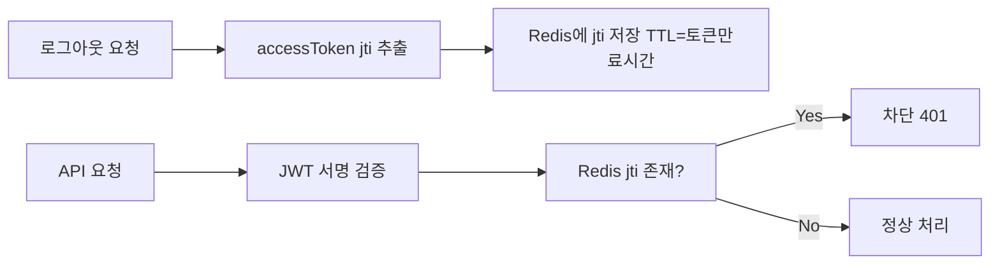
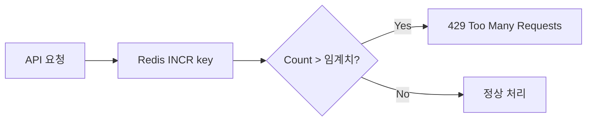

# Redis 도입 계획

## 1. 현재 인증 구조

- JWT 토큰 기반 (stateless)
- `accessToken` → localStorage 저장
- 서버는 JWT 서명만 검증, 세션 저장 안 함
- 로그아웃 = localStorage에서 토큰 삭제 (서버는 무관)

### 한계점

| 문제 | 설명 |
|------|------|
| 로그아웃된 토큰 재사용 가능 | JWT가 만료될 때까지 유효 — 서버에서 강제 만료 불가 |
| 동시 접속 제한 불가 | 같은 계정으로 여러 기기 접속 제한 못 함 |
| refreshToken 탈취 시 무한 갱신 | refreshToken도 localStorage에 평문 저장 |
| 세션 추적 불가 | 현재 로그인된 사용자 현황 파악 불가 |

## 2. Redis 도입 목표

### 2.1 Blocklist (로그아웃/강제 만료)

로그아웃 시 `accessToken`의 `jti`(JWT ID)를 Redis에 저장 → 만료 전에도 해당 토큰 차단

### 2.2 Refresh Token 관리

- refreshToken을 Redis에 저장 (클라이언트 localStorage 아님)
- 갱신 시 Redis의 refreshToken과 비교 검증
- 재사용 감지 (refreshToken rotate 시 이전 토큰 무효화)

### 2.3 세션 관리

| 기능 | Redis 자료구조 | 설명 |
|------|---------------|------|
| 사용자 세션 목록 | `SET user:{userId}:sessions` | 활성 세션 ID 집합 |
| 세션 정보 | `HASH session:{sessionId}` | userAgent, IP, loginTime, device |
| 동시 접속 제한 | `LLEN user:{userId}:sessions` | 허용 개수 초과 시 가장 오래된 세션 만료 |

### 2.4 Rate Limiting

- `SLIDING_WINDOW_LOGIN` → 로그인 시도 5회/10분
- `FIXED_WINDOW_API` → IP당 1000회/1분

## 3. 적용 시나리오

### Phase 1 (Core)
- JWT Blocklist (logout + forced expire)
- Refresh Token Redis 저장

### Phase 2 (Session)
- 세션 목록 조회/관리
- 동시 접속 제한
- 관리자 페이지 "접속 중인 사용자" 표시

### Phase 3 (Scale)
- Rate Limiting
- API 캐싱 (자주 조회하는 공고 등)
- 분산 환경 세션 공유

## 4. 기술 구성

| 항목 | 값 |
|------|-----|
| Redis 버전 | 7.x |
| 배포 방식 | Docker (동일 VM or 별도) |
| 포트 | 6379 (내부망 전용) |
| 인증 | Redis AUTH (비밀번호) |
| Java 클라이언트 | Lettuce (Spring Data Redis 기본) |
| 직렬화 | JSON (GenericJackson2JsonRedisSerializer) |

## 5. 예상 변경 범위

### Backend
- `common/auth` 모듈에 Redis 설정 추가
- `JwtTokenProvider` → Redis blocklist 체크 로직 추가
- `TokenService` (신규) → refreshToken Redis CRUD
- `SessionService` (신규) → 세션 관리
- `RateLimitInterceptor` (신규) → rate limiting

### Frontend
- **변경 불필요** — JWT 발급/갱신 API 응답 구조 동일

### Infra
- Redis Docker 컨테이너 추가
- systemd 의존성: auth 모듈 Redis 이후 시작
- `.env`에 Redis 접속 정보 추가

## 6. 고려사항

| 고려사항 | 검토 |
|---------|------|
| Redis 장애 시 fallback | Redis 연결 실패 → blocklist 검증 생략 (JWT 기본 만료로 fallback) |
| 메모리 사용량 | blocklist는 TTL 자동 만료 → 과다 사용 가능성 낮음 |
| Oracle Cloud A1.Flex 메모리 | 6GB 중 Redis는 여유 있을 것으로 예상 (최소 256MB면 충분) |
| 보안 | Redis를 10.0.0.x 내부망 전용 바인드, 외부 노출 금지 |
